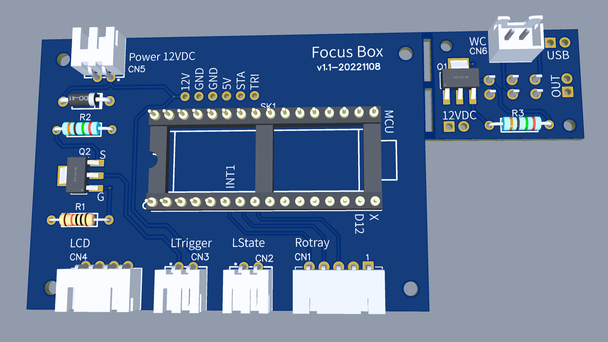

# Focus Box

Focus Box is a simple project designed to help users minimize distractions by physically locking away their phones for a set period of time. The box is crafted from wood and equipped with an Arduino Nano controller, a rotary button, an LCD screen, a titanium wire electronic lock, and a wireless charger. This project was built in collaboration with my friend Fan, with the intention of creating a tangible tool to encourage focused work or quality offline time.

Check out the preview video to see Focus Box in action: [https://www.youtube.com/watch?v=L-Wrue1-h5M](https://www.youtube.com/watch?v=L-Wrue1-h5M)

Note: This repository only includes the electronic schema and Arduino code. The wooden box enclosure is not included.

## Features

- **Time-Locking Mechanism**: Set a countdown timer using the rotary button. Once the time is set, the box locks automatically and cannot be reopened until the countdown ends.
- **LCD Screen**: Displays the countdown timer so you know how much time remains until the box unlocks.
- **Rotary Button Control**: Simple, intuitive rotary button to adjust the desired lock time.
- **Titanium Wire Electronic Lock**: The box uses a secure titanium wire electronic lock to keep your phone safely locked inside.
- **Wireless Charger**: The inside of the box is equipped with a wireless charger, so your phone can continue charging while it's locked away.

## Use Cases

- **Productivity Boost**: Lock your phone away during work or study sessions to stay focused.
- **Family Time**: Use Focus Box to prevent distractions during quality family time or social gatherings.
- **Break from Social Media**: Take a scheduled break from your phone to limit social media use and encourage mindful habits.

## Main Components

- [Arduino Nano](https://core-electronics.com.au/nano-v3-0-board.html?gad_source=1&gclid=CjwKCAjwvKi4BhABEiwAH2gcw0ash12JGuspvZv-oz__nVjO7_g3aRKabuhVpIOeAQcVlDGEAny_tBoCtw4QAvD_BwE) controller
- [Rotary Encoder](https://www.jaycar.com.au/arduino-compatible-rotary-encoder-module/p/XC3736) for input
- [LCD1602 with I2C](https://core-electronics.com.au/lcd1602-i2c-module-white-color-with-blue-background-16x2-characters-lcd-33v5v.html?gad_source=1&gclid=CjwKCAjwvKi4BhABEiwAH2gcw-ugFo4uhphvJI0WSJrz59PekVGBFBZd-rGQgjitmfcRYIXNNeOPbBoCtUYQAvD_BwE) to show countdown
- [Graphene Titanium wire electronic lock](https://www.aliexpress.com/item/1005003619650242.html)
- 12V Wireless charging module
- 12V DC Power Supply
- USB-C PD 12V Trigger Board
- Wooden box enclosure (not included in this repo)

## Schema and Parts

The schema can be found in the `assets` folder, which is generated by EasyEDA. You may download and import the schema/PCB file, and find the BOM list.

The schema is divided into two sections: one for input, display, and lock control, and another for power supply. This project supports two types of power supply. The 12V DC power supply not only ensures the Arduino and locker function but also powers the wireless charger. Additionally, there is a backup power supply via a USB-C power bank, which only activates the Arduino timer and unlocks the locker, without powering the wireless charger.

To make soldering easier, especially since this is my first PCB project, I used XH connectors and larger components rather than using SMDs.

## Arduino Dependencies

LiquidCrystal_I2C
https://github.com/johnrickman/LiquidCrystal_I2C

> LiquidCrystal_I2C is used to control the LCD screen.

EEPROMWearLevel
https://github.com/PRosenb/EEPROMWearLevel

> EEPROMWearLevel is used to store the timer value in EEPROM, which is necessary to keep the timer value even after power off.

if you can not find the library in the Library Manager, plese copy the one in `libraries` folder to `~/Documents/Arduino/libraries`.

## License

Focus Box is released under the MIT License. Feel free to use, modify, and share as you like!

## Acknowledgments

- Special thanks to my friend Fan for their help in building this project.
- The open-source hardware and software community for their incredible resources and inspiration.
